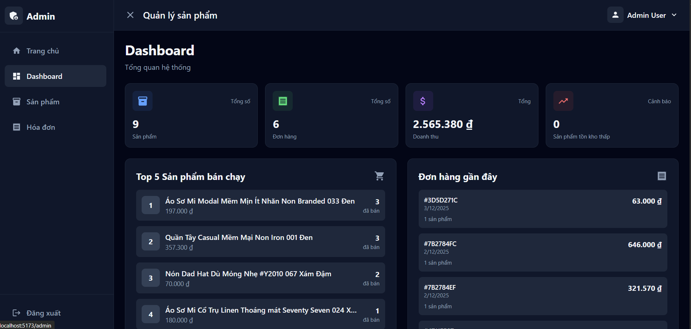

# Dark Hawk - E-Commerce Platform

Hệ thống website thương mại điện tử được xây dựng với mục đích quản lý và bán hàng trực tuyến, bao gồm trang khách hàng và trang quản trị.


_Giao diện trang chủ với danh sách sản phẩm nổi bật_

## 🚀 Tính năng

### Khách hàng

- 🏠 **Trang chủ**: Xem danh sách sản phẩm với tìm kiếm, lọc theo danh mục, phân trang
- 🛍️ **Chi tiết sản phẩm**: Xem thông tin chi tiết, đánh giá, giá giảm
- 🛒 **Giỏ hàng**: Thêm/xóa/cập nhật số lượng sản phẩm
- 💳 **Mua hàng**: Mua ngay hoặc thanh toán từ giỏ hàng
- 📦 **Đơn hàng**: Xem lịch sử đơn hàng đã đặt

### Quản trị viên

- 📊 **Dashboard**: Thống kê tổng quan (sản phẩm, đơn hàng, doanh thu)
- 📦 **Quản lý sản phẩm**: Thêm/sửa/xóa sản phẩm, tạo slug tự động
- 🧾 **Quản lý hóa đơn**: Xem danh sách đơn hàng từ khách hàng
- 📈 **Báo cáo**: Top sản phẩm bán chạy, đơn hàng gần đây


_Trang quản trị với thống kê tổng quan hệ thống_

## 🛠️ Công nghệ sử dụng

### Frontend

- **React 19** - UI Framework
- **TypeScript** - Type Safety
- **Redux Toolkit** - State Management
- **React Router** - Routing
- **TailwindCSS 4** - Styling
- **Vite** - Build Tool
- **Axios** - HTTP Client

### Backend

- **Node.js** + **Express** - Server Framework
- **TypeScript** - Type Safety
- **MongoDB** + **Mongoose** - Database
- **CORS** - Cross-Origin Resource Sharing

## 📋 Yêu cầu hệ thống

- Node.js >= 18.x
- MongoDB >= 6.x
- npm hoặc yarn

## 🔧 Cài đặt

### 1. Clone repository

```bash
git clone https://github.com/TrDieux18/BaiTapPTTKHT.git
cd BaiTapPTTKHT
```

### 2. Cài đặt Backend

```bash
cd be
npm install
```

Tạo file `.env` trong thư mục `be`:

```env
PORT=3000
MONGODB_URI=mongodb://localhost:27017/darkhawk
```

### 3. Cài đặt Frontend

```bash
cd fe
npm install
```

## 🚀 Chạy ứng dụng

### 1. Khởi động Backend

```bash
cd be
npm run dev
```

Server sẽ chạy tại: `http://localhost:3000`

### 2. Khởi động Frontend

```bash
cd fe
npm run dev
```

Ứng dụng sẽ chạy tại: `http://localhost:5173`

## 👤 Tài khoản mẫu

### Admin

- **Username**: `admin`
- **Password**: `admin123`

### User

- **Username**: `user`
- **Password**: `user123`

## 📁 Cấu trúc thư mục

```
BaiTapPTTKHT/
├── be/                          # Backend
│   ├── src/
│   │   ├── config/              # Cấu hình database, system
│   │   ├── controllers/         # Business logic
│   │   ├── models/              # Mongoose schemas
│   │   ├── routes/              # API routes
│   │   ├── types/               # TypeScript types
│   │   └── server.ts            # Entry point
│   └── package.json
│
├── fe/                          # Frontend
│   ├── src/
│   │   ├── components/          # Reusable components
│   │   ├── layouts/             # Layout components
│   │   ├── pages/               # Page components
│   │   │   ├── admin/           # Admin pages
│   │   │   ├── client/          # Client pages
│   │   │   └── common/          # Shared pages
│   │   ├── services/            # API services
│   │   ├── store/               # Redux store
│   │   ├── types/               # TypeScript types
│   │   ├── helpers/             # Utility functions
│   │   └── App.tsx              # Main component
│   └── package.json
│
└── README.md
```

## 🌟 Tính năng nổi bật

### Component Reusability

- **Input, TextArea**: Form components tái sử dụng với validation
- **ProductForm**: Form chung cho tạo/sửa sản phẩm
- **SearchInput, CategorySelect, Pagination**: Components filter và navigation

### UX/UI

- Dark theme hiện đại với TailwindCSS
- Responsive design cho mọi thiết bị
- Smooth animations và transitions
- Loading states và error handling

### Performance

- Code splitting với React lazy loading
- Debounced search
- Optimized Redux state management
- Efficient data fetching

## 📝 API Endpoints

### Products

- `GET /products` - Lấy danh sách sản phẩm (có phân trang, tìm kiếm, lọc)
- `GET /products/:id` - Lấy chi tiết sản phẩm
- `POST /admin/products/new` - Tạo sản phẩm mới
- `PATCH /admin/products/edit` - Cập nhật sản phẩm
- `DELETE /admin/products/delete/:id` - Xóa sản phẩm

### Cart

- `GET /cart/:userId` - Lấy giỏ hàng
- `POST /cart/add` - Thêm vào giỏ hàng
- `PATCH /cart/update` - Cập nhật số lượng
- `DELETE /cart/remove` - Xóa sản phẩm khỏi giỏ
- `DELETE /cart/clear/:userId` - Xóa toàn bộ giỏ hàng

### Invoices

- `POST /invoices` - Tạo hóa đơn
- `GET /invoices/user/:userId` - Lấy hóa đơn của user
- `GET /admin/invoices` - Lấy tất cả hóa đơn (admin)

### Auth

- `POST /login` - Đăng nhập

## 🔒 Bảo mật

- Input validation và sanitization
- Protected routes cho admin
- Secure password handling
- CORS configuration

## 🐛 Troubleshooting

### Lỗi kết nối MongoDB

Đảm bảo MongoDB đang chạy:

```bash
mongod
```

### Lỗi port đã được sử dụng

Thay đổi port trong file `.env` của backend hoặc `vite.config.ts` của frontend

### Lỗi CORS

Kiểm tra cấu hình CORS trong `be/src/server.ts`

## 👨‍💻 Tác giả

**TrDieux18**

- GitHub: [@TrDieux18](https://github.com/TrDieux18)

## 📄 License

Dự án này được phát hành dưới MIT License.

## 🙏 Acknowledgments

- Thiết kế UI/UX lấy cảm hứng từ các nền tảng thương mại điện tử hiện đại
- Icons từ react-icons (Material Design & Font Awesome)
- Fonts từ Google Fonts
